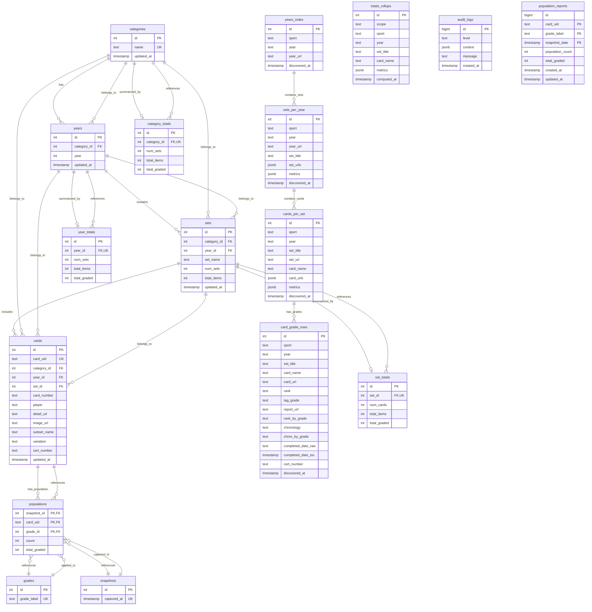

# TAG Grading Scraper - Database Relationship Diagram

## Entity Relationship Diagram

The following diagram shows the relationships between all database tables in the TAG Grading Scraper system.

## Key Relationship Types

### One-to-Many (1:N)
- **categories → years**: Each sport category can have multiple years
- **years → sets**: Each year can have multiple card sets
- **sets → cards**: Each set can have multiple cards
- **cards → populations**: Each card can have multiple population records
- **years_index → sets_per_year**: Each discovered year can have multiple sets
- **sets_per_year → cards_per_set**: Each discovered set can have multiple cards
- **cards_per_set → card_grade_rows**: Each discovered card can have multiple grade rows

### One-to-One (1:1)
- **categories → category_totals**: Each category has exactly one totals record
- **years → year_totals**: Each year has exactly one totals record
- **sets → set_totals**: Each set has exactly one totals record

### Many-to-Many (M:N)
- **cards ↔ grades**: Through the populations table (with snapshot context)
- **cards ↔ snapshots**: Through the populations table (with grade context)

## Data Flow Relationships

### Scraping Flow
1. **years_index** discovers available years for each sport
2. **sets_per_year** discovers sets available for each sport/year combination
3. **cards_per_set** discovers cards available for each sport/year/set combination
4. **card_grade_rows** captures individual grade data for each card

### Aggregation Flow
1. **totals_rollups** provides flexible aggregation at any scope level
2. **category_totals**, **year_totals**, **set_totals** provide specific rollups
3. **populations** captures snapshot-based population data
4. **population_reports** provides historical population tracking

### Audit Flow
1. **audit_logs** tracks all system operations
2. All tables include timestamps for data freshness tracking
3. **snapshots** provides temporal context for population data

## Indexing Strategy

### Primary Keys
- All tables use auto-incrementing integer IDs as primary keys
- Composite primary keys used for junction tables (populations, population_reports)

### Unique Constraints
- **categories.name**: Ensures unique sport names
- **years(category_id, year)**: Ensures unique year per sport
- **sets(year_id, set_name)**: Ensures unique set names per year
- **cards.card_uid**: Ensures unique card identifiers
- **grades.grade_label**: Ensures unique grade labels

### Performance Indexes
- **cards(category_id, year_id, set_id, player)**: Optimizes card queries by sport/year/set/player
- **populations(card_uid, snapshot_id)**: Optimizes population queries
- **audit_logs(created_at DESC)**: Optimizes time-based audit queries
- **population_reports(snapshot_date)**: Partitioned table for efficient time-based queries

## Database Normalization

The schema follows 3NF (Third Normal Form) principles:

1. **First Normal Form (1NF)**: All attributes contain atomic values
2. **Second Normal Form (2NF)**: No partial dependencies on composite keys
3. **Third Normal Form (3NF)**: No transitive dependencies

### Benefits of Normalization
- Eliminates data redundancy
- Prevents update anomalies
- Ensures data consistency
- Optimizes storage usage

### Denormalization Considerations
- **JSONB columns** in multi-level tables for flexible metadata storage
- **Rollup tables** for performance optimization of common queries
- **Partitioned tables** for large datasets (population_reports)

This relationship diagram provides a comprehensive view of how all components in the TAG Grading Scraper database work together to store and manage sports card population data efficiently.
