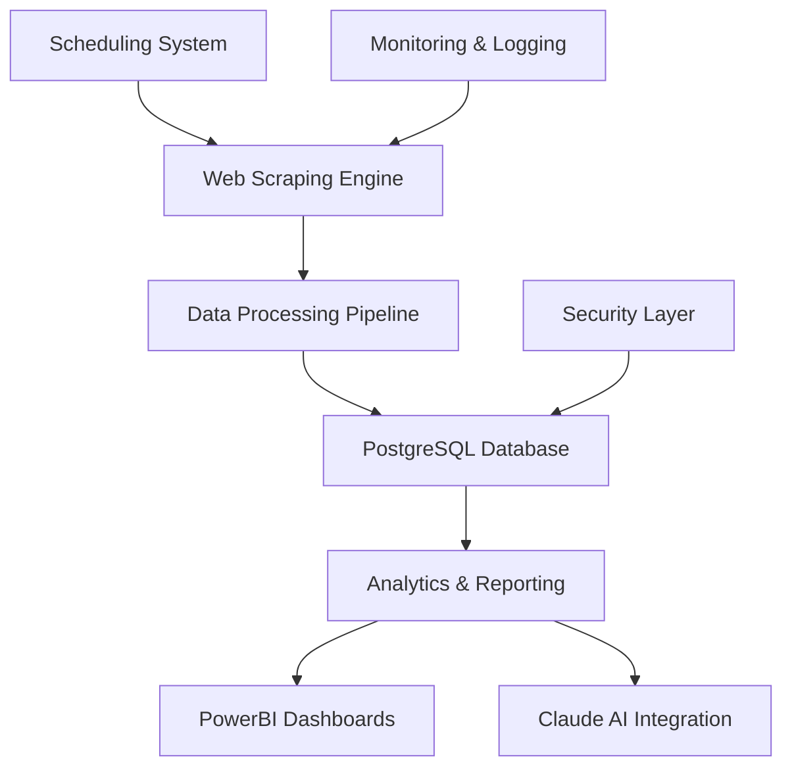

# TAG Grading Scraper - Complete Documentation

## 📚 Documentation Overview

Welcome to the comprehensive documentation for the TAG Grading Scraper system. This documentation covers all aspects of the system from architecture and deployment to integration and usage.

## 🏗️ System Overview

The TAG Grading Scraper is an enterprise-grade web scraping system designed to collect, store, and analyze sports card population data from TAG Grading's population report platform. The system provides a robust foundation for sports card market analysis, investment decision-making, and historical trend tracking.

### Key Features
- **Dynamic Data Discovery**: Automatically discovers new categories, years, sets, and cards
- **Multi-Level Scraping**: Hierarchical processing from sports to individual card grades
- **Enterprise Database**: PostgreSQL with normalized schema and comprehensive relationships
- **Flexible Scheduling**: Configurable cron-based automation
- **Cloud Ready**: Docker-based deployment for any cloud platform
- **BI Integration**: Direct PowerBI connectivity for reporting
- **AI Integration**: Claude AI for natural language querying and analysis

## 📖 Documentation Structure

### 1. [Project Overview](./PROJECT_OVERVIEW.md)
Comprehensive system overview including architecture, features, and capabilities.

**What you'll learn:**
- System architecture and components
- Key features and capabilities
- Data model and relationships
- Use cases and applications
- Performance characteristics
- Security features

### 2. [Database Schema](./DATABASE_SCHEMA.md)
Complete database schema documentation with table definitions and relationships.

**What you'll learn:**
- All database tables and columns
- Data types and constraints
- Table relationships and foreign keys
- Indexing strategy
- Data flow and normalization
- Query examples

### 3. [Database Relationships](./DATABASE_RELATIONSHIPS.md)
Visual database relationship diagrams using Mermaid syntax.

**What you'll learn:**
- Entity relationship diagrams
- Relationship types (1:1, 1:N, M:N)
- Data flow relationships
- Indexing strategy
- Database design principles

### 4. [Docker Deployment](./DOCKER_DEPLOYMENT.md)
Complete guide for deploying the system in cloud environments.

**What you'll learn:**
- Security configuration and best practices
- Cloud deployment (AWS, GCP, Azure)
- Production deployment checklist
- Maintenance and operations
- Monitoring and alerting
- Backup and recovery strategies

### 5. [Scheduling Configuration](./SCHEDULING_CONFIGURATION.md)
Comprehensive guide to configuring and customizing the scraping schedule.

**What you'll learn:**
- Scheduling architecture and components
- Cron expression configuration
- Common scheduling scenarios
- Advanced configuration options
- Monitoring and troubleshooting
- Performance considerations

### 6. [PowerBI Connection](./POWERBI_CONNECTION.md)
Complete guide to connecting PowerBI for reporting and analysis.

**What you'll learn:**
- Database connection setup
- ODBC driver installation
- Data model design
- Report design examples
- Advanced analytics
- Performance optimization

### 7. [Claude AI Integration](./CLAUDE_AI_INTEGRATION.md)
Guide to integrating Claude AI for intelligent querying and analysis.

**What you'll learn:**
- Integration architecture
- API setup and configuration
- Natural language querying
- Query processing engine
- Web API service
- Security and best practices

## 🚀 Quick Start

### Prerequisites
- Docker and Docker Compose
- PostgreSQL database (or use included Docker setup)
- Python 3.8+ (for local development)

### Local Development Setup
```bash
# Clone the repository
git clone <repository-url>
cd "New Scraping Tool"

# Copy environment configuration
cp env.example .env

# Edit environment variables
nano .env

# Start the system
docker-compose up -d

# Check status
docker-compose ps

# View logs
docker-compose logs -f
```

### Environment Configuration
```bash
# Database Configuration
POSTGRES_USER=your_username
POSTGRES_PASSWORD=your_secure_password
POSTGRES_DB=tag_grading_db
POSTGRES_PORT=5432

# Pipeline Configuration
PIPELINE_MAX_CONCURRENCY=3
PIPELINE_DELAY=2.0
# Use 'discover' to automatically find all available categories
# Or specify specific categories: Baseball,Hockey,Basketball,Football,Soccer,Golf,Racing,Wrestling,Gaming,Non-Sport
PIPELINE_CATEGORIES=discover

# Scheduling Configuration
PIPELINE_SCHEDULE=0 2 * * 0  # Sundays at 2 AM
PIPELINE_TIMEZONE=UTC
```

## 🔧 System Architecture

### Core Components


### Data Flow
1. **Discovery**: Multi-level scraping discovers new data sources
2. **Processing**: Intelligent data processing and validation
3. **Storage**: Normalized storage in PostgreSQL database
4. **Analysis**: PowerBI and Claude AI analysis capabilities
5. **Reporting**: Comprehensive reporting and insights

## 📊 Data Model

### Core Entities
- **Categories**: Sports (Baseball, Hockey, Basketball, Football, etc.)
- **Years**: Year-based organization of data
- **Sets**: Card set identification and metadata
- **Cards**: Individual card information and details
- **Grades & Populations**: Grade distribution and population data

### Key Relationships
- Categories → Years (1:many)
- Years → Sets (1:many)
- Sets → Cards (1:many)
- Cards → Populations (1:many)
- Grades → Populations (1:many)

## 🌐 Deployment Options

### Local Development
- Docker-based local environment
- Development-friendly configuration
- Easy debugging and testing

### Cloud Deployment
- **AWS EC2**: Ubuntu instances with Docker
- **Google Cloud**: Compute Engine deployment
- **Azure**: Virtual Machine deployment
- **Any Cloud**: Docker-compatible platforms

### Production Features
- High availability deployment
- Load balancing and scaling
- Comprehensive monitoring
- Automated backup strategies
- Security hardening

## 🔌 Integration Capabilities

### PowerBI Integration
- Direct database connectivity
- Real-time data access
- Custom dashboard creation
- Automated data refresh
- Team collaboration

### Claude AI Integration
- Natural language querying
- Intelligent data analysis
- Automated insight generation
- Trend analysis and forecasting
- RESTful API access

### API Access
- Secure RESTful endpoints
- Authentication and authorization
- Rate limiting and monitoring
- Comprehensive documentation
- Multiple SDK support

## 📈 Use Cases

### Market Analysis
- Population trend tracking
- Supply and demand analysis
- Investment opportunity identification
- Risk assessment and management
- Competitive analysis

### Investment Decision Making
- Portfolio performance analysis
- Data-driven valuation models
- Buy/sell timing optimization
- Diversification strategies
- Risk management

### Business Intelligence
- Inventory management
- Performance metrics
- Trend identification
- Predictive analytics
- Automated reporting

## 🛡️ Security Features

### Data Security
- Environment variable management
- Database access control
- Audit logging and tracking
- Data encryption support
- Privacy protection measures

### Network Security
- Firewall configuration
- Network isolation
- SSL/TLS encryption
- VPN support
- Intrusion detection

### Application Security
- Input validation
- SQL injection protection
- Authentication mechanisms
- Authorization controls
- Security headers

## 📊 Monitoring & Maintenance

### System Monitoring
- Health checks and monitoring
- Performance metrics tracking
- Resource utilization monitoring
- Automated alerting
- Centralized logging

### Maintenance Operations
- Automated database maintenance
- Log rotation and management
- Backup and recovery procedures
- System updates and patches
- Performance optimization

### Troubleshooting
- Diagnostic tools and capabilities
- Error tracking and analysis
- Performance analysis tools
- Comprehensive documentation
- Support resources

## 🚀 Getting Started

### 1. Choose Your Path
- **Quick Start**: Use Docker for immediate setup
- **Development**: Set up local development environment
- **Production**: Follow production deployment guide
- **Integration**: Connect PowerBI or Claude AI

### 2. Configuration
- **Environment**: Configure environment variables
- **Database**: Set up database connection
- **Scheduling**: Configure scraping schedule
- **Security**: Implement security measures

### 3. Deployment
- **Local**: Docker Compose for development
- **Cloud**: Cloud platform deployment
- **Production**: Production-ready deployment
- **Scaling**: Horizontal scaling configuration

### 4. Integration
- **PowerBI**: Connect for reporting
- **Claude AI**: Enable AI-powered analysis
- **APIs**: Use RESTful API endpoints
- **Monitoring**: Set up monitoring and alerting

## 📚 Additional Resources

### Code Examples
- [Pipeline Configuration](./SCHEDULING_CONFIGURATION.md#code-examples)
- [Database Queries](./DATABASE_SCHEMA.md#query-examples)
- [API Integration](./CLAUDE_AI_INTEGRATION.md#usage-examples)

### Troubleshooting
- [Common Issues](./DOCKER_DEPLOYMENT.md#troubleshooting)
- [Performance Optimization](./POWERBI_CONNECTION.md#performance-optimization)
- [Security Best Practices](./DOCKER_DEPLOYMENT.md#security-hardening)

### Best Practices
- [Deployment Checklist](./DOCKER_DEPLOYMENT.md#production-deployment-checklist)
- [Security Guidelines](./DOCKER_DEPLOYMENT.md#security-configuration)
- [Performance Tips](./SCHEDULING_CONFIGURATION.md#best-practices)

## 🤝 Support & Community

### Documentation
- **Comprehensive Guides**: Detailed documentation for all features
- **Code Examples**: Practical examples and use cases
- **Best Practices**: Industry-standard implementation patterns
- **Troubleshooting**: Common issues and solutions

### Getting Help
- **Documentation**: Start with the relevant guide
- **Examples**: Review code examples and use cases
- **Troubleshooting**: Check troubleshooting sections
- **Community**: Join user community forums

### Contributing
- **Documentation**: Help improve documentation
- **Code**: Contribute to system development
- **Testing**: Help test and validate features
- **Feedback**: Provide feedback and suggestions

## 📄 License & Legal

### System Usage
- **Educational**: Use for learning and research
- **Commercial**: Use for business and commercial purposes
- **Compliance**: Ensure compliance with applicable laws
- **Terms**: Follow platform terms of service

### Data Usage
- **Respectful Scraping**: Follow rate limiting guidelines
- **Data Privacy**: Respect data privacy requirements
- **Terms of Service**: Comply with website terms
- **Ethical Use**: Use data responsibly and ethically

## 🔄 Version History

### Current Version
- **Version**: 1.0.0
- **Release Date**: 2024
- **Features**: Complete multi-level scraping system
- **Documentation**: Comprehensive documentation suite

### Future Releases
- **Advanced Analytics**: ML-powered insights
- **Enhanced Integration**: Additional third-party support
- **Performance Improvements**: Advanced optimization
- **Mobile Support**: Mobile application development

---

## 🎯 Next Steps

1. **Choose Your Path**: Select the appropriate documentation for your needs
2. **Set Up Environment**: Follow the quick start guide
3. **Configure System**: Set up your specific requirements
4. **Deploy & Test**: Deploy and validate your setup
5. **Integrate & Analyze**: Connect PowerBI and Claude AI
6. **Scale & Optimize**: Optimize for your specific use case

Start with the [Project Overview](./PROJECT_OVERVIEW.md) for a complete understanding of the system, then dive into the specific areas you need to implement or configure.

Happy scraping and analyzing! 🚀📊
