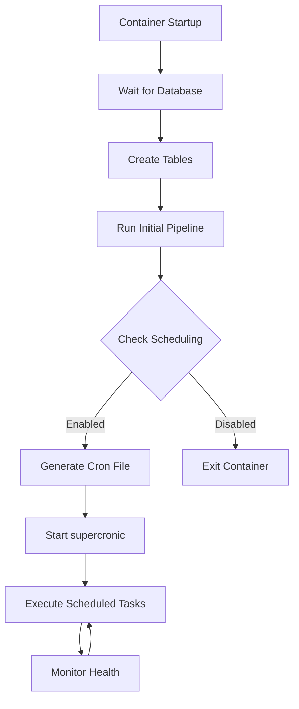
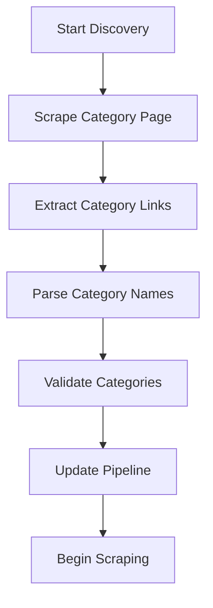

# TAG Grading Scraper - Scheduling Configuration Guide

## Overview

The TAG Grading Scraper includes a flexible scheduling system that allows you to configure when and how often the scraping pipeline runs. The system uses `supercronic` (a lightweight cron alternative) to manage scheduled tasks within Docker containers.

## Scheduling Architecture

### Components
1. **supercronic**: Lightweight cron daemon for containers
2. **Cron File Generation**: Dynamic cron file creation based on environment variables
3. **Pipeline Execution**: Automated scraping pipeline runs
4. **Health Monitoring**: Continuous monitoring of scheduled tasks

### How It Works


## Configuration Options

### 1. Environment Variables

#### Basic Scheduling
```bash
# Enable/disable scheduling
PIPELINE_SCHEDULE=0 2 * * 0          # Enabled: Sundays at 2 AM
PIPELINE_SCHEDULE=disabled            # Disabled: Run once on startup only

# Timezone configuration
PIPELINE_TIMEZONE=UTC                 # Default timezone
PIPELINE_TIMEZONE=America/New_York    # Custom timezone
```

#### Advanced Scheduling
```bash
# Pipeline execution parameters
PIPELINE_MAX_CONCURRENCY=5            # Max parallel requests
PIPELINE_DELAY=2.0                   # Delay between requests (seconds)
# Use 'discover' to automatically find all available categories
# Or specify specific categories: Baseball,Hockey,Basketball,Football,Soccer,Golf,Racing,Wrestling,Gaming,Non-Sport
PIPELINE_CATEGORIES=discover

# Health monitoring
HEALTH_CHECK_INTERVAL=300             # Health check frequency (seconds)
LOG_LEVEL=INFO                        # Logging level
```

### 2. Cron Expression Format

The system uses standard cron expressions with the following format:

```
┌───────────── minute (0 - 59)
│ ┌───────────── hour (0 - 23)
│ │ ┌───────────── day of month (1 - 31)
│ │ │ ┌───────────── month (1 - 12)
│ │ │ │ ┌───────────── day of week (0 - 6) (Sunday = 0)
│ │ │ │ │
│ │ │ │ │
* * * * *
```

#### Common Cron Patterns

| Pattern | Description | Example |
|---------|-------------|---------|
| `0 2 * * 0` | Weekly on Sunday at 2 AM | `PIPELINE_SCHEDULE=0 2 * * 0` |
| `0 3 * * 1` | Weekly on Monday at 3 AM | `PIPELINE_SCHEDULE=0 3 * * 1` |
| `0 */6 * * *` | Every 6 hours | `PIPELINE_SCHEDULE=0 */6 * * *` |
| `0 2 1 * *` | Monthly on 1st at 2 AM | `PIPELINE_SCHEDULE=0 2 1 * *` |
| `0 2 * * 1-5` | Weekdays at 2 AM | `PIPELINE_SCHEDULE=0 2 * * 1-5` |
| `0 2,14 * * *` | Twice daily at 2 AM and 2 PM | `PIPELINE_SCHEDULE=0 2,14 * * *` |

## Scheduling Scenarios

### 1. Production Weekly Scraping

**Use Case**: Regular weekly updates for production systems

```bash
# .env configuration
PIPELINE_SCHEDULE=0 2 * * 0          # Sundays at 2 AM
PIPELINE_TIMEZONE=UTC                 # UTC timezone
PIPELINE_MAX_CONCURRENCY=3            # Conservative concurrency
PIPELINE_DELAY=2.0                   # 2 second delay between requests
# Use 'discover' to automatically find all available categories
PIPELINE_CATEGORIES=discover

# Benefits
# - Low traffic time (Sunday early morning)
# - Conservative settings for stability
# - Complete coverage of all available sports categories
```

### 2. Development Testing

**Use Case**: Frequent updates during development and testing

```bash
# .env configuration
PIPELINE_SCHEDULE=0 */4 * * *         # Every 4 hours
PIPELINE_TIMEZONE=America/New_York    # Local timezone
PIPELINE_MAX_CONCURRENCY=1            # Single request at a time
PIPELINE_DELAY=5.0                    # 5 second delay
# For testing, specify a single category to reduce load
# For production, use: PIPELINE_CATEGORIES=discover
PIPELINE_CATEGORIES=Baseball

# Benefits
# - Frequent updates for testing
# - Conservative settings to avoid rate limiting
# - Single sport focus for debugging
```

### 3. High-Frequency Monitoring

**Use Case**: Real-time monitoring of specific sports or sets

```bash
# .env configuration
PIPELINE_SCHEDULE=0 */2 * * *         # Every 2 hours
PIPELINE_TIMEZONE=UTC                 # UTC for consistency
PIPELINE_MAX_CONCURRENCY=5            # Higher concurrency
PIPELINE_DELAY=1.0                    # Minimal delay
# Use 'discover' to automatically find all available categories
# Or focus on specific sports: Baseball,Hockey
PIPELINE_CATEGORIES=discover

# Benefits
# - Near real-time updates
# - Higher throughput
# - Complete coverage of all available sports
```

### 4. Maintenance Mode

**Use Case**: System maintenance or troubleshooting

```bash
# .env configuration
PIPELINE_SCHEDULE=disabled            # No scheduling
PIPELINE_MAX_CONCURRENCY=1            # Single request
PIPELINE_DELAY=10.0                   # Long delay
# For troubleshooting, specify a single category to reduce load
# For production, use: PIPELINE_CATEGORIES=discover
PIPELINE_CATEGORIES=Baseball

# Benefits
# - Manual control only
# - Reduced system load
# - Easy troubleshooting
```

## Custom Scheduling Patterns

### 1. Business Hours Only

```bash
# Run only during business hours (9 AM - 5 PM, Monday-Friday)
PIPELINE_SCHEDULE=0 9-17 * * 1-5
```

### 2. Multiple Times Per Day

```bash
# Run at 6 AM, 2 PM, and 10 PM daily
PIPELINE_SCHEDULE=0 6,14,22 * * *
```

### 3. Weekend Focus

```bash
# Run more frequently on weekends
PIPELINE_SCHEDULE=0 */3 * * 0,6      # Every 3 hours on weekends
PIPELINE_SCHEDULE=0 2 * * 1-5        # Once daily on weekdays
```

### 4. Seasonal Adjustments

```bash
# Baseball season (March-October): More frequent
PIPELINE_SCHEDULE=0 */4 * 3-10 *     # Every 4 hours during baseball season

# Off-season (November-February): Less frequent
PIPELINE_SCHEDULE=0 2 * 11-2 *       # Once daily during off-season
```

## Advanced Configuration

### 1. Multiple Schedules

For complex scheduling requirements, you can modify the startup script:

```bash
# Edit bin/run.sh to add multiple cron entries
cat > /app/bin/cron.txt << EOF
# Daily morning update
0 6 * * * cd /app && /app/bin/run_pipeline.sh --categories Baseball >> /app/logs/cron_morning.log 2>&1

# Daily evening update
0 18 * * * cd /app && /app/bin/run_pipeline.sh --categories Hockey >> /app/logs/cron_evening.log 2>&1

# Weekly full update
0 2 * * 0 cd /app && /app/bin/run_pipeline.sh --all-sports >> /app/logs/cron_weekly.log 2>&1
EOF
```

### 2. Conditional Scheduling

```bash
# Add logic to bin/run.sh for conditional execution
if [[ "$(date +%u)" -eq 1 ]]; then
    # Monday: Full update
    PIPELINE_CATEGORIES="Baseball,Hockey,Basketball,Football"
elif [[ "$(date +%u)" -eq 4 ]]; then
    # Thursday: Baseball and Hockey only
    PIPELINE_CATEGORIES="Baseball,Hockey"
else
    # Other days: Baseball only
    PIPELINE_CATEGORIES="Baseball"
fi
```

### 3. Dynamic Concurrency

```bash
# Adjust concurrency based on time of day
HOUR=$(date +%H)
if [[ $HOUR -ge 9 && $HOUR -le 17 ]]; then
    # Business hours: Lower concurrency
    PIPELINE_MAX_CONCURRENCY=2
    PIPELINE_DELAY=3.0
else
    # Off-hours: Higher concurrency
    PIPELINE_MAX_CONCURRENCY=5
    PIPELINE_DELAY=1.0
fi
```

## Monitoring and Maintenance

### 1. Schedule Validation

```bash
# Validate cron expression
docker-compose exec scraper bash -c "echo '0 2 * * 0' | supercronic -test"

# Check current cron file
docker-compose exec scraper cat /app/bin/cron.txt

# View supercronic logs
docker-compose logs scraper | grep supercronic
```

### 2. Schedule Changes

```bash
# Update environment variables
nano .env

# Restart services to apply changes
docker-compose down
docker-compose up -d

# Verify new schedule
docker-compose exec scraper cat /app/bin/cron.txt
```

### 3. Manual Execution

```bash
# Run pipeline manually
docker-compose exec scraper /app/bin/run_pipeline.sh

# Run with specific parameters
docker-compose exec scraper /app/bin/run_pipeline.sh --categories Baseball --concurrency 3

# Check execution status
docker-compose logs scraper --tail=100
```

## Troubleshooting Scheduling Issues

### 1. Common Problems

#### Schedule Not Running
```bash
# Check if supercronic is running
docker-compose exec scraper ps aux | grep supercronic

# Check cron file
docker-compose exec scraper cat /app/bin/cron.txt

# Check supercronic logs
docker-compose logs scraper | grep -i cron
```

#### Timezone Issues
```bash
# Check container timezone
docker-compose exec scraper date

# Verify timezone environment variable
docker-compose exec scraper env | grep TIMEZONE

# Set timezone in container
docker-compose exec scraper ln -sf /usr/share/zoneinfo/America/New_York /etc/localtime
```

#### Permission Issues
```bash
# Check script permissions
docker-compose exec scraper ls -la /app/bin/

# Fix permissions if needed
docker-compose exec scraper chmod +x /app/bin/run_pipeline.sh
```

### 2. Debug Mode

```bash
# Enable debug logging
LOG_LEVEL=DEBUG

# Restart with debug
docker-compose down
docker-compose up -d

# Monitor debug logs
docker-compose logs -f scraper
```

### 3. Schedule Testing

```bash
# Test cron expression
docker-compose exec scraper bash -c "echo '*/1 * * * *' | supercronic -test"

# Test with 1-minute interval (for testing only)
PIPELINE_SCHEDULE="*/1 * * * *"  # Every minute - FOR TESTING ONLY

# Monitor execution
docker-compose logs -f scraper
```

## Performance Considerations

### 1. Resource Management

```bash
# Adjust based on system resources
PIPELINE_MAX_CONCURRENCY=3            # Conservative for small instances
PIPELINE_MAX_CONCURRENCY=10           # Aggressive for large instances

# Memory considerations
PIPELINE_DELAY=2.0                    # Higher delay = lower memory usage
PIPELINE_DELAY=0.5                    # Lower delay = higher memory usage
```

### 2. Rate Limiting

```bash
# Respect target website rate limits
PIPELINE_DELAY=2.0                    # 2 second delay between requests
PIPELINE_MAX_CONCURRENCY=3            # Max 3 concurrent requests

# Monitor for rate limiting responses
LOG_LEVEL=INFO                         # Monitor for 429 responses
```

### 3. Database Performance

```bash
# Schedule during low database usage
PIPELINE_SCHEDULE=0 2 * * 0          # Early morning (low traffic)

# Consider database maintenance windows
# Avoid scheduling during backup operations
```

## Best Practices

### 1. Schedule Design
- **Choose low-traffic times** for production systems
- **Use conservative settings** initially, then optimize
- **Consider target website** rate limits and terms of service
- **Plan for maintenance** windows and system updates

### 2. Monitoring
- **Monitor execution logs** regularly
- **Set up alerts** for failed executions
- **Track performance metrics** over time
- **Review and adjust** schedules based on results

### 3. Maintenance
- **Regular schedule reviews** (monthly/quarterly)
- **Update schedules** based on business needs
- **Test schedule changes** in development first
- **Document schedule decisions** and rationale

### 4. Security
- **Use environment variables** for sensitive configuration
- **Restrict access** to scheduling configuration
- **Monitor for unauthorized** schedule changes
- **Regular security audits** of scheduling systems

## Category Discovery Configuration

### 1. Automatic Category Discovery

The TAG Grading Scraper includes an intelligent category discovery system that automatically finds all available sports categories on the platform.

#### How It Works
```bash
# Set this in your .env file to enable automatic discovery
PIPELINE_CATEGORIES=discover

# The system will:
# 1. Scrape the main category page
# 2. Extract all available sports categories
# 3. Dynamically adjust the scraping pipeline
# 4. Handle new categories automatically
```

#### Discovered Categories
The system automatically discovers these categories (and any new ones added):
- **Baseball** - Traditional baseball cards
- **Hockey** - NHL and hockey cards
- **Basketball** - NBA and basketball cards
- **Football** - NFL and football cards
- **Soccer** - International soccer cards
- **Golf** - Professional golf cards
- **Racing** - Motorsports and racing cards
- **Wrestling** - Professional wrestling cards
- **Gaming** - Video game and esports cards
- **Non-Sport** - Entertainment and other cards

### 2. Manual Category Selection

For testing, development, or specific use cases, you can manually specify categories:

#### Single Category (Testing)
```bash
# Test with a single category
PIPELINE_CATEGORIES=Baseball

# Benefits:
# - Faster execution
# - Lower resource usage
# - Easier debugging
# - Reduced rate limiting risk
```

#### Multiple Specific Categories
```bash
# Focus on specific sports
PIPELINE_CATEGORIES=Baseball,Hockey,Basketball

# Benefits:
# - Targeted coverage
# - Controlled resource usage
# - Specific business needs
```

#### All Categories (Manual)
```bash
# Manually specify all categories
PIPELINE_CATEGORIES=Baseball,Hockey,Basketball,Football,Soccer,Golf,Racing,Wrestling,Gaming,Non-Sport

# Benefits:
# - Explicit control
# - Predictable execution time
# - No discovery overhead
```

### 3. Discovery vs. Manual Configuration

#### When to Use Discovery
```bash
# Production environments
PIPELINE_CATEGORIES=discover

# Benefits:
# - Automatic adaptation to new categories
# - Future-proof configuration
# - Complete coverage
# - Minimal maintenance
```

#### When to Use Manual Configuration
```bash
# Development and testing
PIPELINE_CATEGORIES=Baseball

# Benefits:
# - Faster execution
# - Predictable behavior
# - Easier debugging
# - Controlled resource usage
```

### 4. Discovery Process Details

#### Discovery Workflow


#### Discovery Performance
```bash
# Discovery timing:
# - Initial discovery: ~30 seconds
# - Category validation: ~10 seconds per category
# - Total setup time: ~2-5 minutes

# Discovery overhead:
# - Minimal impact on scraping performance
# - One-time cost per pipeline run
# - Automatic optimization
```

### 5. Advanced Discovery Configuration

#### Discovery with Filters
```bash
# The system automatically handles:
# - New categories added to the platform
# - Removed categories
# - Category name changes
# - Category URL updates
```

#### Discovery Error Handling
```bash
# If discovery fails:
# 1. System falls back to default categories
# 2. Logs error for investigation
# 3. Continues with available categories
# 4. Retries discovery on next run
```

#### Discovery Monitoring
```bash
# Monitor discovery process:
docker-compose logs scraper | grep -i "discover"

# Expected output:
# INFO: Discovered 10 categories: ['Baseball', 'Hockey', ...]
# INFO: Starting pipeline for 10 categories
# INFO: Category Baseball: Processing...
```

This scheduling configuration guide provides comprehensive coverage of all aspects of configuring and managing the TAG Grading Scraper's automated execution schedule.
