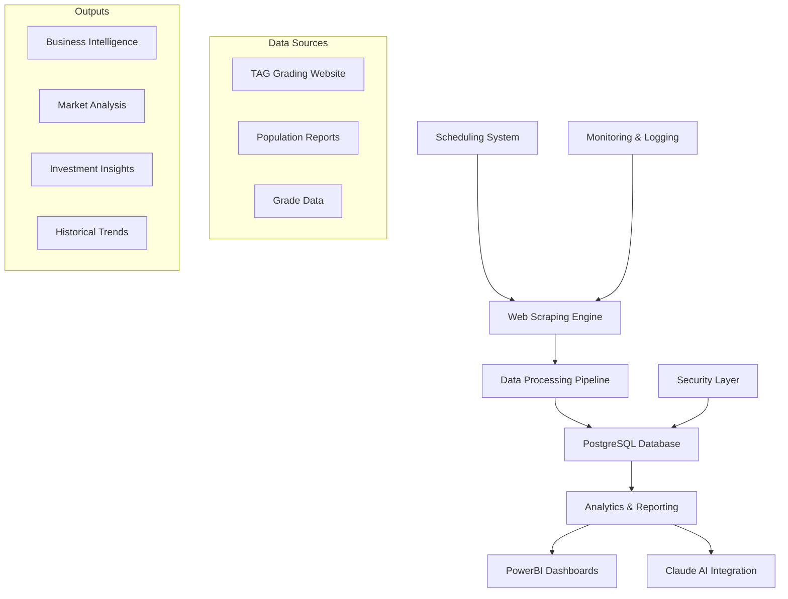
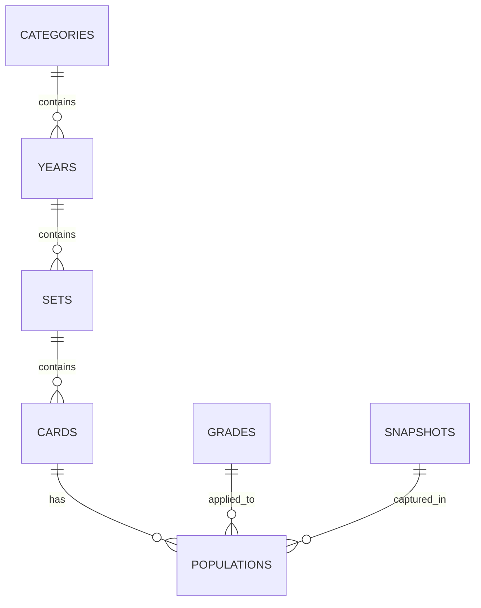

# TAG Grading Scraper - Project Overview

## Executive Summary

The TAG Grading Scraper is a comprehensive, enterprise-grade web scraping system designed to collect, store, and analyze sports card population data from TAG Grading's population report platform. The system provides a robust foundation for sports card market analysis, investment decision-making, and historical trend tracking.

## System Architecture

### High-Level Overview


### Core Components

#### 1. Multi-Level Scraping Engine
- **Dynamic Discovery**: Automatically discovers new categories, years, sets, and cards
- **Hierarchical Processing**: Processes data in logical hierarchy (Sport → Year → Set → Card → Grade)
- **Parallel Processing**: Configurable concurrency for optimal performance
- **Rate Limiting**: Respectful scraping with configurable delays
- **Error Handling**: Robust error handling with retry logic

#### 2. Data Storage System
- **PostgreSQL Database**: Enterprise-grade relational database
- **Normalized Schema**: 3NF design for data integrity and performance
- **Audit Logging**: Comprehensive tracking of all operations
- **Data Partitioning**: Efficient handling of large datasets
- **Backup & Recovery**: Automated backup strategies

#### 3. Scheduling & Automation
- **Flexible Scheduling**: Cron-based scheduling with custom patterns
- **Container Orchestration**: Docker-based deployment and management
- **Health Monitoring**: Continuous system health checks
- **Auto-restart**: Automatic recovery from failures

#### 4. Analytics & Reporting
- **PowerBI Integration**: Direct database connectivity for reporting
- **Claude AI Integration**: Natural language querying and analysis
- **Custom Dashboards**: Pre-built analytics dashboards
- **Data Export**: Multiple export formats for external analysis

## Key Features

### 1. Dynamic Data Discovery
The system automatically discovers and adapts to new data sources:

```python
# Example: Automatic discovery of all available sports categories
# The system automatically:
# - Discovers all available categories from the main page
# - Identifies new categories as they're added to the platform
# - Adapts the scraping pipeline dynamically
# - Handles category changes automatically

# Supported categories (automatically discovered):
# Baseball, Hockey, Basketball, Football, Soccer, Golf, Racing, Wrestling, Gaming, Non-Sport
# Plus any new categories added to the platform
```

### 2. Intelligent Data Processing
Advanced data processing with built-in intelligence:

- **Duplicate Detection**: Prevents duplicate data entry
- **Data Validation**: Ensures data quality and consistency
- **Relationship Mapping**: Maintains referential integrity
- **Historical Tracking**: Tracks changes over time
- **Aggregation**: Pre-computed totals and rollups

### 3. Scalable Architecture
Designed for enterprise-scale operations:

- **Horizontal Scaling**: Multiple scraper instances
- **Load Balancing**: Distributed processing capabilities
- **Resource Management**: Configurable memory and CPU limits
- **Database Optimization**: Strategic indexing and partitioning
- **Caching Strategy**: Multi-level caching for performance

### 4. Security & Compliance
Enterprise-grade security features:

- **Environment Variables**: Secure credential management
- **Network Isolation**: Docker network security
- **Access Control**: Database user permissions
- **Audit Logging**: Complete operation tracking
- **SSL Support**: Encrypted database connections

## Data Model

### Core Entities
The system captures data across multiple dimensions:

#### 1. Categories (Sports)
- Baseball, Hockey, Basketball, Football, etc.
- Dynamic discovery of new sports
- Sport-specific metadata and totals

#### 2. Years
- Year-based organization of data
- Historical tracking and trends
- Year-level aggregations and summaries

#### 3. Sets
- Card set identification and metadata
- Set-level population statistics
- Set performance metrics over time

#### 4. Cards
- Individual card information
- Player details and card metadata
- Card images and detail URLs

#### 5. Grades & Populations
- Grade distribution data
- Population counts by grade
- Historical population tracking
- Grade performance analytics

### Data Relationships


## Scraping Capabilities

### 1. Multi-Level Discovery
The system operates at multiple levels simultaneously:

```python
# Level 1: Sport Discovery
for sport in sports:
    # Discover available years
    years = discover_years(sport)
    
    # Level 2: Year Discovery
    for year in years:
        # Discover available sets
        sets = discover_sets(year)
        
        # Level 3: Set Discovery
        for set in sets:
            # Discover available cards
            cards = discover_cards(set)
            
            # Level 4: Card Discovery
            for card in cards:
                # Discover grade populations
                populations = discover_populations(card)
```

### 2. Intelligent Scraping
Advanced scraping with built-in intelligence:

- **Adaptive Parsing**: Handles website structure changes
- **Content Extraction**: Extracts structured data from HTML
- **Image Handling**: Captures card images and URLs
- **Link Discovery**: Follows and discovers new content
- **Error Recovery**: Graceful handling of scraping failures

### 3. Performance Optimization
Optimized for speed and efficiency:

- **Parallel Processing**: Configurable concurrency levels
- **Rate Limiting**: Respectful scraping practices
- **Caching**: Intelligent caching of frequently accessed data
- **Batch Processing**: Efficient bulk data operations
- **Resource Management**: Optimal memory and CPU usage

## Deployment Options

### 1. Local Development
```bash
# Quick local setup
git clone <repository>
cd "New Scraping Tool"
cp env.example .env
# Edit .env with your configuration
docker-compose up -d
```

### 2. Cloud Deployment
Comprehensive cloud deployment support:

#### AWS EC2
- Ubuntu 20.04 LTS instances
- Docker and Docker Compose
- Automated deployment scripts
- CloudWatch monitoring

#### Google Cloud Platform
- Compute Engine instances
- Container-optimized images
- Load balancing and scaling
- Cloud Logging integration

#### Azure
- Virtual Machine deployment
- Container Registry integration
- Application Insights monitoring
- Auto-scaling capabilities

### 3. Production Considerations
Enterprise production deployment features:

- **High Availability**: Multi-instance deployment
- **Load Balancing**: Nginx-based load balancing
- **Monitoring**: Comprehensive system monitoring
- **Backup**: Automated backup strategies
- **Security**: Network and application security
- **Scaling**: Auto-scaling capabilities

## Integration Capabilities

### 1. PowerBI Integration
Direct database connectivity for business intelligence:

- **Real-time Data**: Live connection to database
- **Custom Dashboards**: Pre-built analytics dashboards
- **Data Refresh**: Automated data refresh scheduling
- **Export Capabilities**: Multiple export formats
- **Collaboration**: Team sharing and collaboration

### 2. Claude AI Integration
Natural language querying and analysis:

- **Natural Language Queries**: Ask questions in plain English
- **Intelligent Analysis**: AI-powered data interpretation
- **Insight Generation**: Automated insight discovery
- **Trend Analysis**: Historical trend identification
- **Predictive Analytics**: Future trend predictions

### 3. API Access
RESTful API for external integrations:

- **Data Access**: Secure API endpoints
- **Authentication**: API key-based security
- **Rate Limiting**: Configurable rate limits
- **Documentation**: Comprehensive API documentation
- **SDK Support**: Multiple programming language SDKs

## Use Cases

### 1. Market Analysis
Comprehensive sports card market analysis:

- **Population Trends**: Track grade population changes over time
- **Market Dynamics**: Analyze supply and demand patterns
- **Investment Opportunities**: Identify undervalued cards
- **Risk Assessment**: Evaluate market risks and volatility
- **Competitive Analysis**: Compare different card sets and years

### 2. Investment Decision Making
Data-driven investment strategies:

- **Portfolio Analysis**: Analyze card portfolio performance
- **Valuation Models**: Build data-driven valuation models
- **Timing Strategies**: Optimize buy/sell timing
- **Diversification**: Portfolio diversification strategies
- **Risk Management**: Risk assessment and mitigation

### 3. Historical Research
Comprehensive historical data analysis:

- **Player Performance**: Historical player card performance
- **Set Analysis**: Complete set performance analysis
- **Grade Evolution**: Grade distribution changes over time
- **Market Cycles**: Identify market cycles and patterns
- **Event Impact**: Analyze impact of events on card values

### 4. Business Intelligence
Operational and strategic insights:

- **Inventory Management**: Track card inventory and availability
- **Performance Metrics**: Key performance indicators
- **Trend Analysis**: Identify emerging trends
- **Forecasting**: Predictive analytics and forecasting
- **Reporting**: Automated report generation

## Performance Characteristics

### 1. Scalability
Designed for enterprise-scale operations:

- **Horizontal Scaling**: Multiple scraper instances
- **Database Scaling**: Optimized for large datasets
- **Load Distribution**: Efficient load balancing
- **Resource Optimization**: Optimal resource utilization
- **Performance Monitoring**: Continuous performance tracking

### 2. Reliability
High-availability system design:

- **Fault Tolerance**: Graceful handling of failures
- **Auto-recovery**: Automatic system recovery
- **Health Monitoring**: Continuous health checks
- **Backup Strategies**: Comprehensive backup and recovery
- **Disaster Recovery**: Disaster recovery planning

### 3. Efficiency
Optimized for performance and cost:

- **Resource Utilization**: Optimal CPU and memory usage
- **Network Efficiency**: Minimized network overhead
- **Storage Optimization**: Efficient data storage
- **Processing Speed**: Fast data processing
- **Cost Management**: Cost-effective operations

## Security Features

### 1. Data Security
Comprehensive data protection:

- **Encryption**: Data encryption at rest and in transit
- **Access Control**: Role-based access control
- **Audit Logging**: Complete audit trail
- **Data Privacy**: Privacy protection measures
- **Compliance**: Regulatory compliance support

### 2. Network Security
Secure network architecture:

- **Firewall Protection**: Network firewall configuration
- **VPN Support**: Virtual private network support
- **SSL/TLS**: Encrypted communications
- **Network Isolation**: Container network isolation
- **Intrusion Detection**: Security monitoring and alerting

### 3. Application Security
Secure application design:

- **Input Validation**: Comprehensive input validation
- **SQL Injection Protection**: SQL injection prevention
- **Authentication**: Secure authentication mechanisms
- **Authorization**: Proper authorization controls
- **Security Headers**: Security header configuration

## Monitoring & Maintenance

### 1. System Monitoring
Comprehensive system monitoring:

- **Health Checks**: Continuous health monitoring
- **Performance Metrics**: Performance tracking
- **Resource Monitoring**: Resource utilization tracking
- **Alert Systems**: Automated alerting
- **Log Aggregation**: Centralized logging

### 2. Maintenance Operations
Automated maintenance procedures:

- **Database Maintenance**: Automated database maintenance
- **Log Rotation**: Automated log management
- **Backup Operations**: Automated backup procedures
- **Update Management**: System update management
- **Performance Tuning**: Continuous performance optimization

### 3. Troubleshooting
Comprehensive troubleshooting support:

- **Diagnostic Tools**: Built-in diagnostic capabilities
- **Error Tracking**: Comprehensive error tracking
- **Performance Analysis**: Performance analysis tools
- **Log Analysis**: Advanced log analysis
- **Support Documentation**: Comprehensive documentation

## Future Enhancements

### 1. Advanced Analytics
Enhanced analytical capabilities:

- **Machine Learning**: ML-powered insights
- **Predictive Modeling**: Advanced predictive analytics
- **Natural Language Processing**: Enhanced NLP capabilities
- **Visual Analytics**: Advanced visualization tools
- **Real-time Analytics**: Real-time data analysis

### 2. Integration Expansion
Extended integration capabilities:

- **Third-party APIs**: Additional data source integration
- **Market Data**: Real-time market data integration
- **Social Media**: Social media sentiment analysis
- **News Integration**: News and event impact analysis
- **Mobile Applications**: Mobile app development

### 3. Performance Improvements
Continuous performance optimization:

- **Database Optimization**: Advanced database optimization
- **Caching Strategies**: Enhanced caching mechanisms
- **Load Balancing**: Advanced load balancing
- **Auto-scaling**: Intelligent auto-scaling
- **Performance Monitoring**: Advanced performance tracking

## Conclusion

The TAG Grading Scraper represents a comprehensive, enterprise-grade solution for sports card data collection, analysis, and insights generation. With its robust architecture, advanced features, and extensive integration capabilities, it provides a solid foundation for sports card market analysis, investment decision-making, and business intelligence operations.

The system's design emphasizes:

- **Scalability**: Enterprise-scale operations support
- **Reliability**: High-availability and fault tolerance
- **Security**: Comprehensive security measures
- **Performance**: Optimized for speed and efficiency
- **Flexibility**: Adaptable to changing requirements
- **Integration**: Extensive third-party integration support

Whether deployed locally for development, in the cloud for production, or integrated with existing business intelligence systems, the TAG Grading Scraper provides the tools and capabilities needed to unlock the full potential of sports card population data for analysis, insights, and decision-making.
